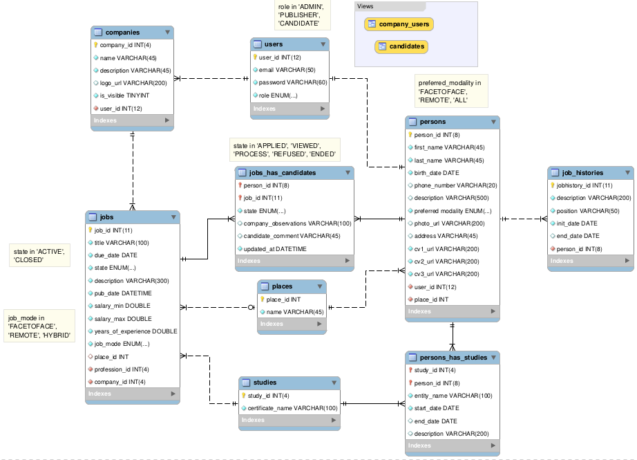

## empleoexprés

Aplicación desarrollada con Spring boot y Thymeleaf, que busca ofrecer funcionalidades propias de un portal de empleos, todo esto como proyecto personal de aprendizaje. Se busca explorar funcionalidades del framework Spring boot y relacionados como:
- Carga de archivos
- Uso y personalización del módulo de seguridad de Springboot mvc
- Generación de reportes con Jasper
- Uso de Thymeleaf para el desarrollo de interfaces gráficas
- Reutilización de componentes HTML con Thymeleaf Fragments
- Creación de directiva personalizada para validación de atributos de una entidad
- Manejo de excepciones
- Sistema basado en roles para limitar el acceso a los servicios a los distintos tipos de usuarios
- Protección de rutas para usuarios no autenticados
- Generación y ejecución de pruebas unitarias y de integración (JUnit y Mockito)

Se sigue el modelo entidad relación descrito a continuación:

### Herramientas empleadas

| Herramienta    | Versión |
|----------------| ------------- |
| Java (Openjdk) | 17.0.7  |
| Spring boot    | 3.0.6  |
| Mariadb        | 10.4.28  |
| Linux Mint     | 21.1 Vera |
| Bootstrap      | 3.3.6 |
